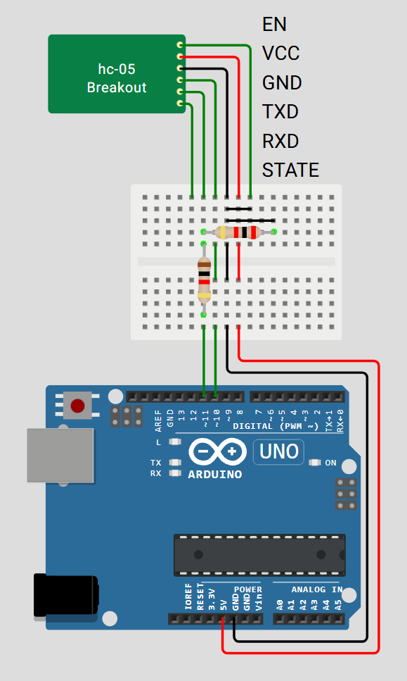

# Test Bluetooth connection

## Description
- Sends message: `Hello! Your random number: <random number [1;1000]>` every 5 seconds
- Echoes back received data
- Adds all text from hardware serial to buffer, sends it via bluetooth on buffer overflow or on NL

**\* *Sends data in own format: `6E <data length> <data> 6E`***

---

## Circuit
\* I actually connected TX and RX the wrong way here, it should be TX -> D11, RX -> D10

